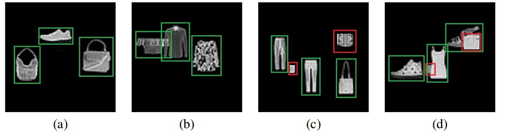

This repository contains Fashion-ZSD dataset of the [Zero-Shot Object Detection by Hybrid Region Embedding](https://arxiv.org/pdf/1805.06157.pdf).

Fashion-ZSD is a toy dataset that we generate for evaluation of ZSD methods, based on the [Fashion-MNIST](https://github.com/zalandoresearch/fashion-mnist) dataset. Fashion-MNIST originally consists of Zalando’s article images with associated labels. This dataset contains 70,000 grayscale images of size 28x28, and 10 classes. For Zero-shot detection task, we split the dataset into two disjoint sets; seven classes are used in training and three classes are used as the unseen test classes.

The dataset consists of images from four different scenarios. From left-to-right in image, (a)full objects only, (b)partial occlusions, (c)clutter regions included, and (d)a scene withboth partial occlusions and clutter regions. Ground truth object regions are shown with green and noise regions are shown in red boxes.

Training Classes:

    - tshirt
    - trouser
    - coat
    - sandal
    - shirt
    - sneaker
    - bag

Test Classes:

    - ankle_boot
    - dress
    - pullover
